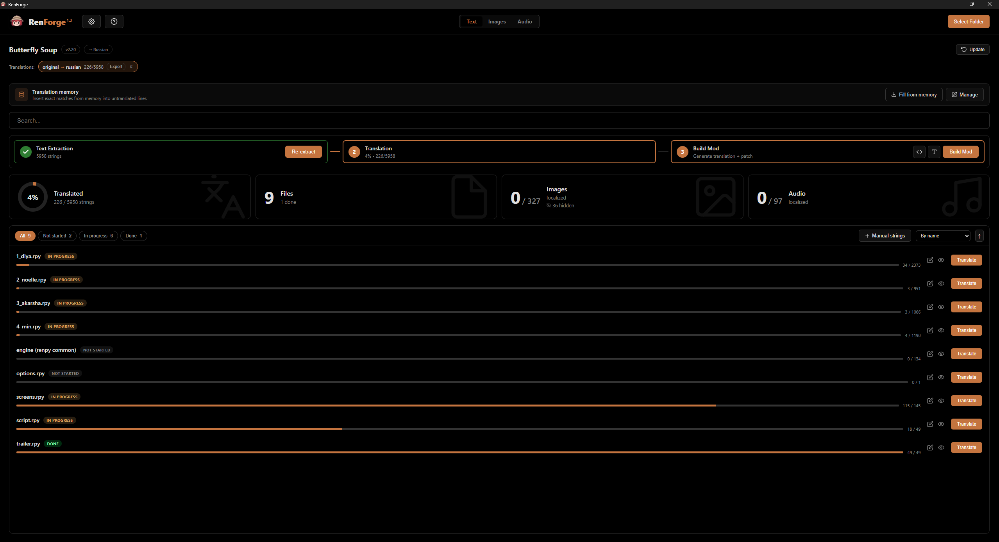
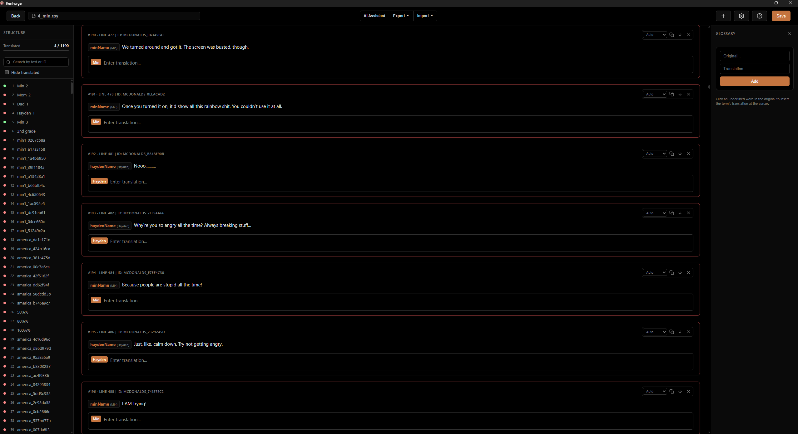
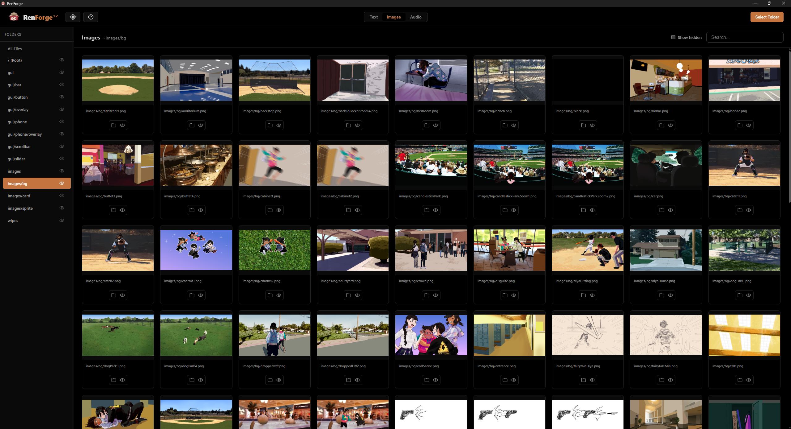
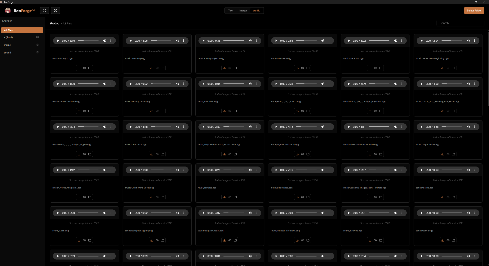

<div align="center">


# RenForge

**Extract, translate and build translation mods for Ren'Py games — all in one window.**

[Русский](README.ru.md) · **English**


</div>

---

A GUI tool for text extraction, localization and translation-mod building for games made with the **Ren'Py** engine. Asset unpacking, string extraction, a translation editor, media localization and final mod assembly — all in one window, with no Python installation and no Ren'Py SDK.

Platform: **Windows x64**. License: **GPL-3.0**.

## Screenshots

<table>
  <tr>
    <td align="center"><br><sub>Dashboard</sub></td>
    <td align="center"><br><sub>Translation editor</sub></td>
  </tr>
  <tr>
    <td align="center"><br><sub>Image localization</sub></td>
    <td align="center"><br><sub>Audio localization</sub></td>
  </tr>
</table>

## Features

- **Standalone** — no Python or external dependencies required.
- **Text extraction** straight from `.rpyc` via AST analysis of the bytecode (Ren'Py 6.x–8.x), plus automatic `.rpa` unpacking.
- **Language pairs** — multiple translations (`source → target`) in a single project, each with its own database and progress, with quick switching.
- **Translation editor** — line by line, with `{...}` tag and `[...]` variable integrity checks, a glossary, search, and translation transfer between game versions. Manual add/edit/delete of strings; per-string delivery channel override.
- **Source viewer** — `.rpyc` decompilation (unrpyc) with syntax highlighting and a minimap: extracted strings are highlighted, potentially missed ones are offered for one-click adding.
- **AI translation (LLM)** — local models (Ollama), a cloud OpenAI-compatible API, or the clipboard; in batches, in chunks, with response alignment checks.
- **Translation Memory (TM)** — auto-accumulation of pairs and auto-fill of exact matches flagged "to review".
- **Media** — localization of images and audio (with line transliteration for dubbing).
- **Delivery** — language-independent runtime text substitution (no game language switching and no conflict with the game's own localization selector), hot reload (Shift+R), font replacement. Expert delivery hooks for non-standard statements.
- **Build** — export a full game with the embedded translation, or a standalone overlay mod.

## Installation

From the release page:

- **`RenForge_v1.2.0_Windows_Installer.msi`** — installer (MSI).
- **`RenForge_v1.2.0_Portable.zip`** — portable build.

The WebView2 runtime is bundled into the installer (works offline).

> Work on a copy of the game in a regular user folder. If the game lives in `Program Files` or a Steam directory, the app may lack write permissions — copy it somewhere like the desktop.

## Quick start

1. "Select folder" → the game's root directory (where the `.exe` is).
2. In settings, pick the source language and the target language.
3. "Extract text" — unpacks `.rpa` and collects strings into the database.
4. Translate in the editor (glossary, tag checks) or via the AI assistant.
5. "Images" / "Audio" — swap media.
6. "Build mod" — inject the translation. Launch the game or press Shift+R for a hot reload.
7. "Translations" → "Export": full game or mod only.

## How it works

### Extraction

The extractor reads compiled `.rpyc` bytecode directly — no `.rpy` sources required. It unpickles the embedded AST (handling the zlib stream and legacy formats), then walks the tree and collects translatable text by statement type: dialogue (`Say`), choices (`Menu`), screen/UI strings, `_()` calls, `Text(_("..."))` inside `layeredimage`/`image`, and `renpy.input` prompts. Each string is classified by channel (`dialogue` / `menu` / `ui` / `python`) and stored with its file, line and Ren'Py translation ID. The engine version and legacy language-suffixed files (`script_ru.rpyc`, etc.) are detected automatically. The bundled `unrpyc` provides full decompilation for the source viewer.

### Delivery

Delivery does **not** use Ren'Py's built-in translation blocks and does **not** switch the game language (that poisons `persistent._preferences.language` and crashes games that index dictionaries by language). Instead RenForge generates a single crash-safe runtime `.rpy` that substitutes text **by its original string** at runtime — fully language-independent.

Translations are split into two dictionaries (dialogue/menu vs. UI) and delivered through several channels:

- **`say_menu_text_filter`** — dialogue and menu text.
- **Direct injection into `translator.strings`** — UI strings (bypasses `add()` and its collision check, so it overrides even the game's own translations without crashing).
- **An early `_()` / `translate_string` hook** (placed in `python early`, before init) — catches UI text baked into images at build time.
- **`renpy.input` wrapper** — prompts (player name, etc.).
- **`renpy.ui.text` wrapper** — UI strings on legacy engines (6.12–6.17) that have no translation framework.

Strings with a foreign `[var]` placeholder are skipped to avoid `KeyError` in the game. Advanced users can weave custom Python/Ren'Py code into delivery via expert hooks (with a ready-made API and syntax checking).

## Stack

- **Frontend:** Vue 3 + Vite.
- **Backend:** Rust (Tauri 2.0).
- **Storage:** SQLite — translation progress (per language pair), statistics, glossary.
- **Sidecars:** `unrpa` (`.rpa` unpacking) and `rpyc_extractor` (our own AST extractor; includes unrpyc for decompilation in the source viewer). Sources are in `src-tauri/tools/`.

## Building from source

Requires Node.js and Rust (the Tauri toolchain). Prebuilt sidecars are in `src-tauri/bin/`.

```
npm install
npm run tauri build
```

## Licensing

RenForge is distributed under the **GNU GPL v3.0**.

Third-party components:

| Component | License | Purpose |
| :--- | :--- | :--- |
| [unrpa](https://github.com/Lattyware/unrpa) | GPL-3.0 | `.rpa` archive unpacking |
| [unrpyc](https://github.com/CensoredUsername/unrpyc) | MIT (`codegen.py` — BSD-3) | `.rpyc` decompilation (source viewer) |

Full license texts are in `src-tauri/licenses/`, and inside the app: "About" → "Open licenses folder".
